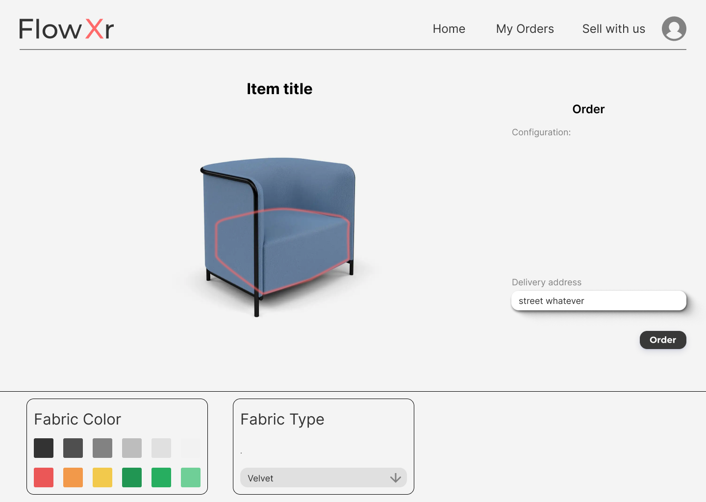

# flow-xr-demo
Demo Only - Flow Xr - powered by 3D &amp; Realtime web technologies, Flow Xr is an E-commerce platform promoting personalized &amp; documented orders.

 

> Hello world! This is the project’s summary that describes the project plain and simple, limited to the space available. 


**[PROJECT PHILOSOPHY](https://github.com/hsein-bitar/flow-xr#project-philosophy) • [WIREFRAMES](https://github.com/hsein-bitar/flow-xr#wireframes) • [TECH STACK](https://github.com/hsein-bitar/flow-xr#tech-stack) • [IMPLEMENTATION](https://github.com/hsein-bitar/flow-xr#implementation) • [HOW TO RUN?](https://github.com/hsein-bitar/flow-xr#how-to-run)**

 
 

 

> Flow Xr allows you to customize and personalize items before you buy. Flow Xr aims to make online shoppoing more enjoyable; it encourages you to reflect on your preferences.
> 
> Flow Xr offers a 3D configurator to show you how the end design would look like

### User Stories
- As a user, I want to be able to personalize items in 3D, change colors and properties, and then order
- As a seller, I want to offer products that users can customize
- As a seller, I want to be able to manage all my orders, with my team, in one place
- As a member of a workspace, I want to be able to manage all order am involved with in one place
- As an admin, I want to be able to add new categories, and accept new stores on the platform

  

 

> This design was planned before on paper, then moved to Figma app for the fine details.
Note that I didn't use any styling library or theme, all from scratch and using pure css modules

| Landing                                      | Home /Search                                  |
| -------------------------------------------- | --------------------------------------------- |
|  |  |

| Customize                                       | Order ChatRoom                                  |
| ----------------------------------------------- | ----------------------------------------------- |
|  |  |

 
 

 

> Here's a brief high-level overview of the tech stack that Flow Xr uses:

- To send/receive messages and be notified of incoming orders in real-time, the app uses the [Socket.IO](https://socket.io/), a package that offers bidirectional and low-latency communication for every platform
- This project uses the [ThreeJS 3D Library](https://threejs.org/).A WebGL-based 3D engine, it has the tools to create, display, and texture meshes in 3d space, and to add light sources and cameras.
- For persistent storage (database), the app uses a locally installed [MongoDB](https://www.mongodb.com/) community server.
- The backend builds on [ExpressJS](https://expressjs.com/) a fast, unopinionated, minimalist web framework for Node.js
- For the user interface, the app uses [ReactJS](https://reactjs.org/) a free and open-source front-end JavaScript library for building user interfaces based on UI components.
- For the global state management, the app uses ["Redux Toolkit"](https://redux-toolkit.js.org/)  
- The app uses the font ["Inter"](https://fonts.google.com/specimen/Inter) as its main font.

 
 

 

> Using the above mentioned tech stack and the wireframes built with figma from the user stories we have, the implementation of the app is shown below, these are screen recordings from the real app

| Landing                                         | Home /Search                                       |
| ----------------------------------------------- | -------------------------------------------------- |
|  |  |

| Personalize Orders in 3D                                           | Allow Item you are Selling to be Configured                        |
| ------------------------------------------------------------------ | ------------------------------------------------------------------ |
|  |  |

| Orders Realtime Dashboard                                                   | Order Chat Room                                           |
| --------------------------------------------------------------------------- | --------------------------------------------------------- |
|  |  |

| Start Selling /Logo Preview                                                    | Add Item                                                           |
| ------------------------------------------------------------------------------ | ------------------------------------------------------------------ |
|  |  |

 
 

 

> The source code of this project is not public